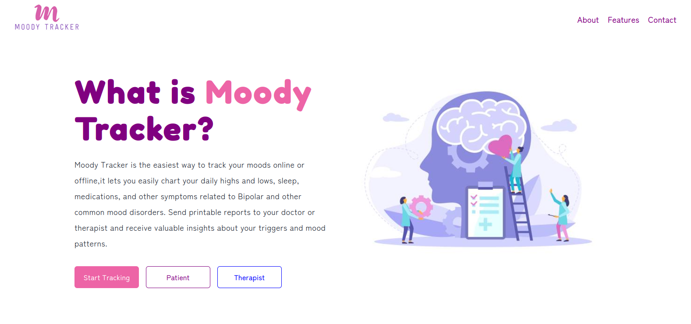
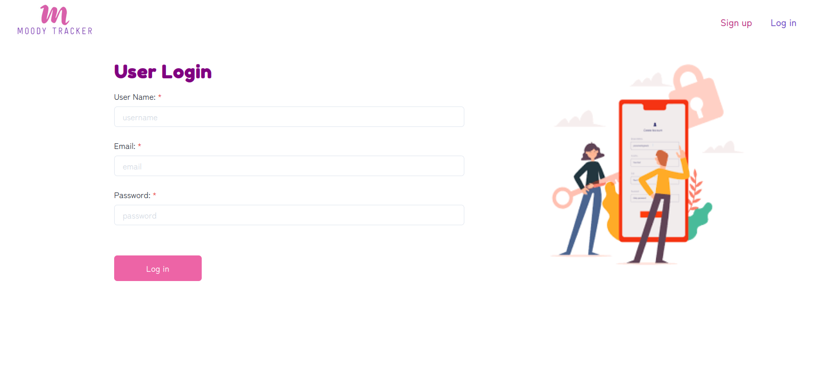
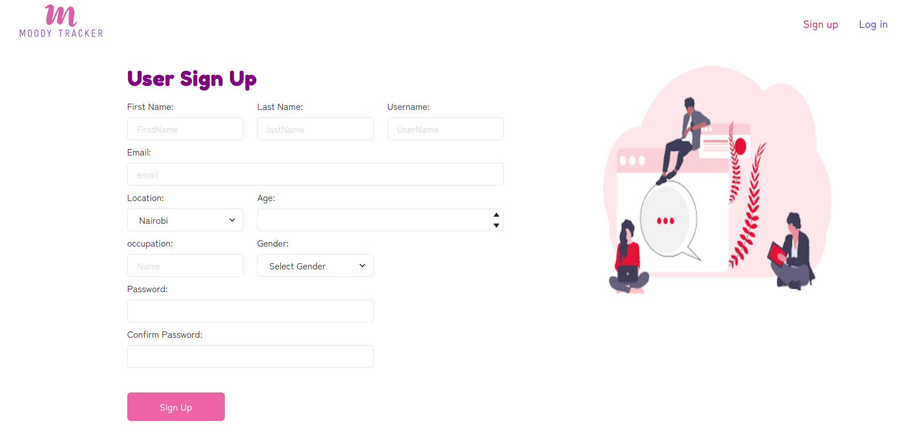
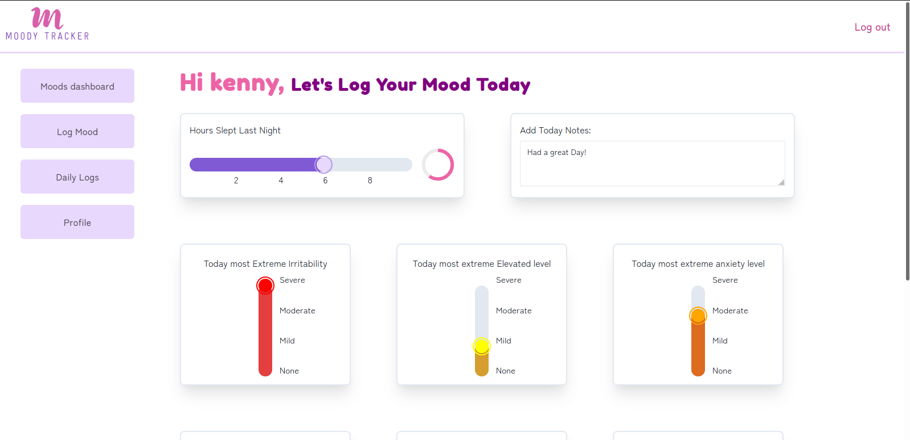
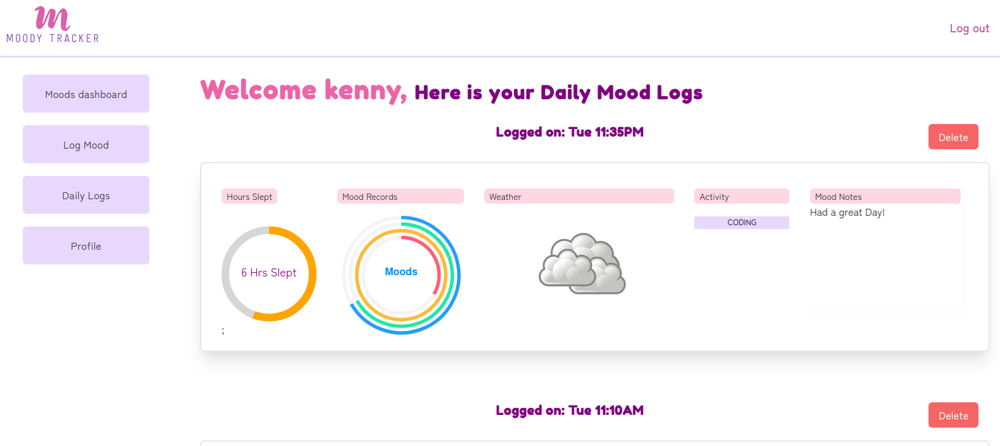
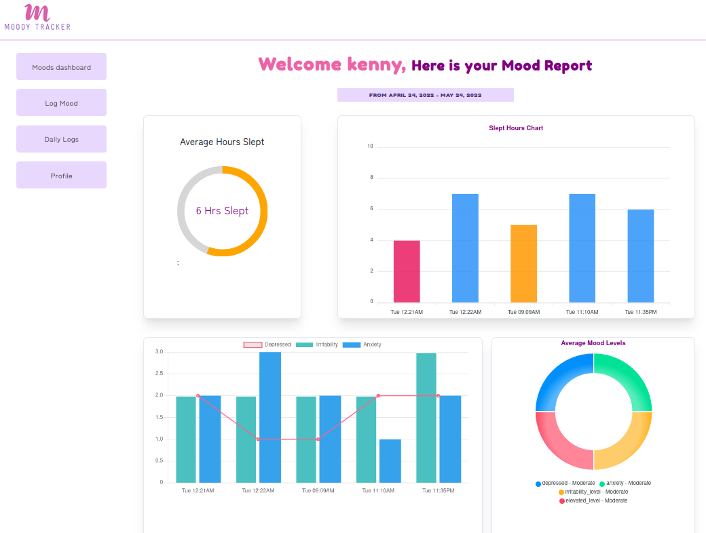
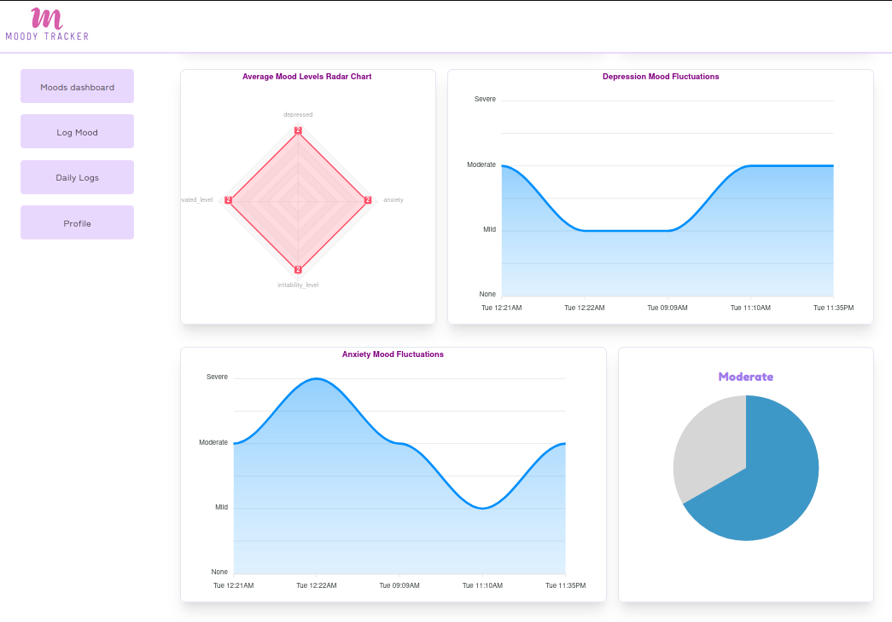
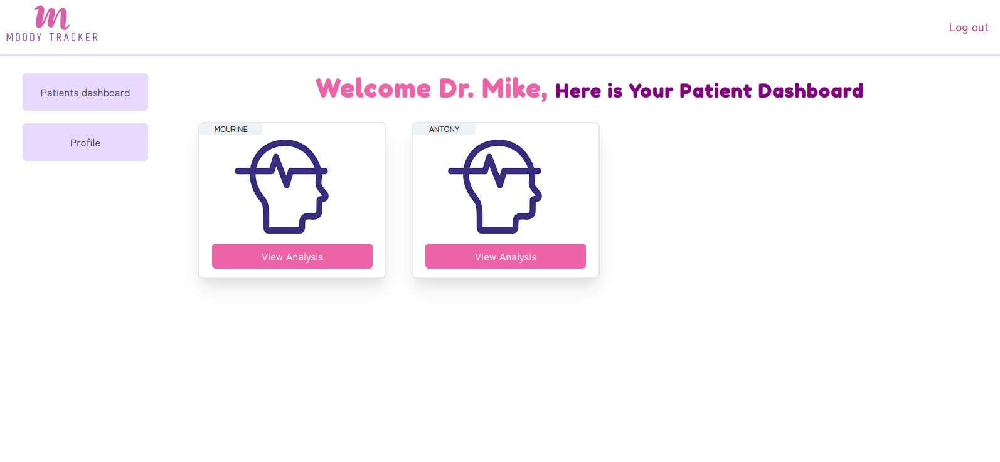

<p align="center">

</p>
<p align="center"> 
<span style="font-size:4em;font-weight:bold;">Moody Tracker Frontend </span>
</p>

# Table of contents
* [Project Description](#project-description)
* [Technologies](#technologies)
* [Prerequisites](#prerequisites)
* [Setup](#how-to-install-and-run-the-project)
* [Screenshots](#screenshots)

# Project Description

Moody Tracker is a mental health tracking system that facilitates awareness and reflection of moods, so users can better
understand the influencing factors, and thus be able to change these to improve their mental health. For those who are already battling various mental health disorders, the system aids in their treatment process as it provides their respective therapist previous mental health data of the patient.

## Technologies

- JavaScript
- React
- Chakra UI

# Getting Started

## Prerequisites

- node
- Moody Tracker Backend is set up and running on localhoost:3001

## How to Install and Run the Project

Clone the repository

```
git clone https://github.com/kenny-kogi/MoodyTracker-Client.git
```

Change Directory

```
cd MoodyTracker/
```

Install Packages

```
npm install
```

Usage

```
npm run start
```

Open localhoost:3000 to view the application

# ScreenShots

## Home



## Login && SignUp

<div style="display:flex;flex-direction:row;">


</div>

## Log Mood

<div style="display:flex;flex-direction:row;">


</div>

## Mood Analysis

<div style="display:flex;flex-direction:row;">


</div>

## Therapist DashBoard


